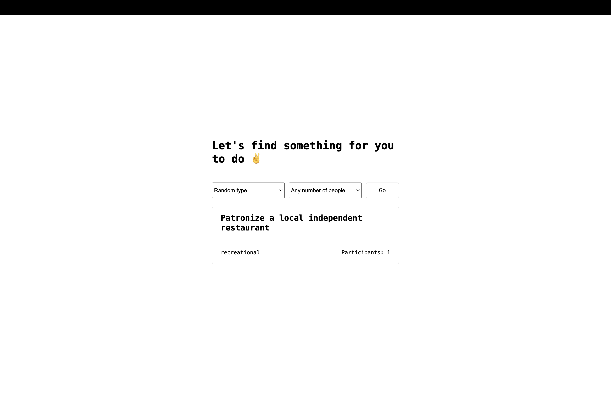

# 🎉 Boredom Buster  

Bored? Not anymore!  
This is a fun full-stack web app built with **Node.js, Express, and EJS** that fetches activities from the [Bored API](https://bored-api.appbrewery.com/).  
It gives you random activity suggestions, or lets you filter by **type** and **participants**.  

---

## ✨ Features
- 🎲 Get a random activity suggestion  
- 🎯 Filter by activity type (Education, Social, Recreational, etc.)  
- 👥 Choose number of participants  
- ⚡ Built with Node.js, Express, and EJS  
- 🎨 Simple and clean UI with custom CSS  

---

## 🛠️ Tech Stack
- **Backend**: Node.js, Express.js  
- **Templating**: EJS  
- **API**: Bored API (https://bored-api.appbrewery.com/)  
- **Frontend**: HTML, CSS  

---

## 📷 Demo


---

## 🚀 Getting Started

### 1. Clone the repository
```bash
git clone https://github.com/your-username/boredom-buster.git
cd boredom-buster

npm install
node index.js
